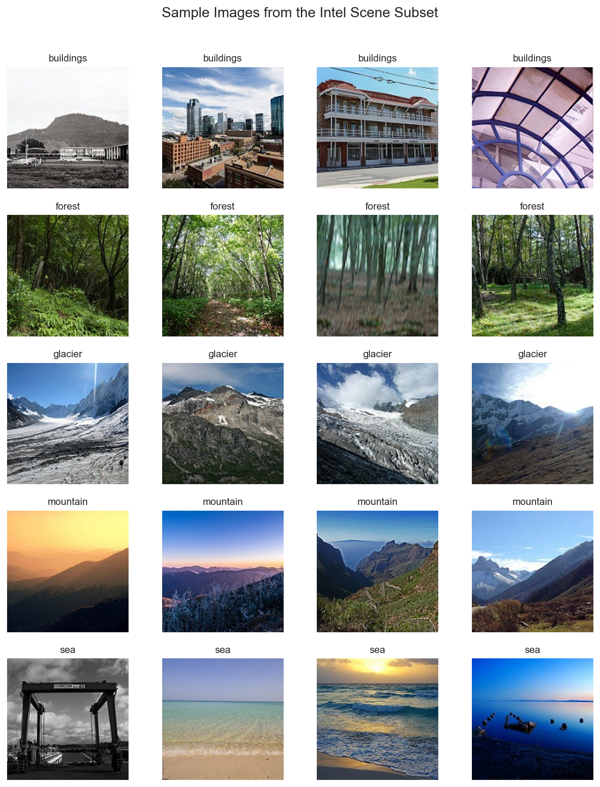
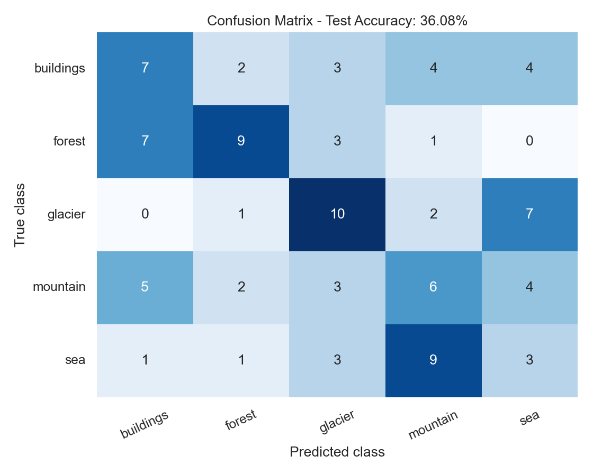

# Softmax Image Classification

This project builds a simple multiclass image classifier for natural scenes using a single softmax layer.

The dataset is a lightweight subset of the Intel Image Classification dataset. Images are resized, flattened into vectors, and classified with a linear layer followed by softmax.

## Project Structure

```text
Softmax_class/
├── data/
│   └── intel_subset/
├── notebooks/
│   └── softmax_image_classification.ipynb
├── outputs/
│   ├── sample_images.png
│   ├── training_curve.png
│   ├── confusion_matrix.png
│   └── prediction_examples.png
├── src/
│   └── softmax_utils.py
├── README.md
├── requirements.txt
└── .gitignore
```

## Method

The model is intentionally simple:

- resize images to 32x32 pixels
- flatten each image into a feature vector
- apply one linear layer
- convert logits to probabilities with softmax
- train with cross-entropy loss and gradient descent

No deep learning framework is used for the model. The softmax classifier is implemented with NumPy.

## Example Images



## Model Evaluation



## How to Run

1. Open this folder in VS Code.
2. Create a local Python environment:

```bash
python3 -m venv .venv
```

3. Activate the environment:

```bash
source .venv/bin/activate
```

4. Install the dependencies:

```bash
pip install -r requirements.txt
```

5. In VS Code, select the local interpreter:

```text
.venv/bin/python
```

6. Open and run:

```text
notebooks/softmax_image_classification.ipynb
```

## Notes

This project is designed as a clear educational implementation of softmax classification. For stronger image performance, a CNN or transfer learning model would be a natural next step.
